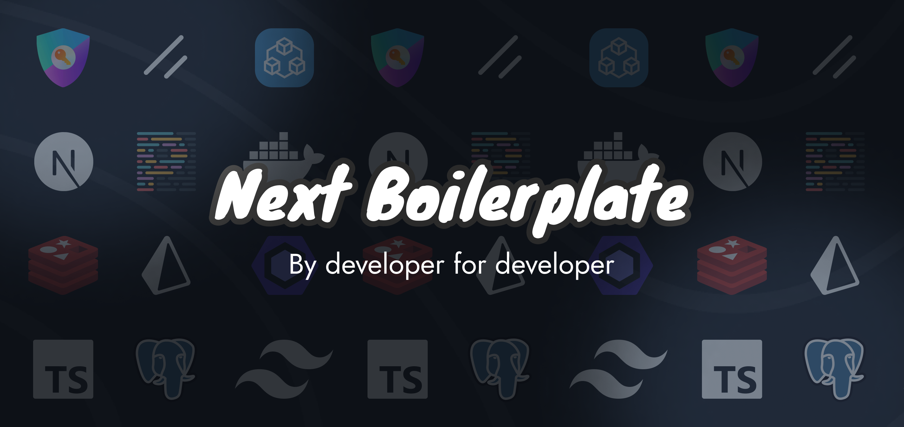

# Next.js Enterprise Boilerplate



[](https://github.com/rharkor/next-boilerplate/blob/main/LICENSE)

Welcome to the _Next.js Boilerplate_, an open-source template for all your nextjs projects! It's loaded with features that'll help you build a high-performance, maintainable, and enjoyable app. We've done all the heavy lifting for you, so sit back, relax, and get ready to conquer the world with your incredible app! 🌍
<br />
<br />
You can test the demo [here](https://next-boilerplate-rharkor.vercel.app/).

> email: `test@mail.com`  
> password: `Azerty123!`

## 📚 Features

With this template, you get all the awesomeness you need:

- 🏎️ **[Next.js](https://nextjs.org/)** - Fast by default, with config optimized for performance
- 💅 **[Tailwind CSS](https://tailwindcss.com/)** - A utility-first CSS framework for rapid UI development
- ✨ **[ESlint](https://eslint.org/)** and **[Prettier](https://prettier.io/)** - For clean, consistent, and error-free code
- 🫙 **[Dev Container](https://code.visualstudio.com/docs/remote/containers)** - For a consistent development environment
- 🐳 **[Docker](https://www.docker.com/)** - For easy deployment
- 🐘 **[PostgreSQL](https://www.postgresql.org/)** - A powerful, open-source relational database system
- 🗃️ **[Prisma](https://www.prisma.io/)** - Next-generation ORM for Node.js and TypeScript
- ⚡ **[Redis](https://redis.io/)** - An in-memory data structure store, used as a database, cache, and message broker
- 🔑 **[Auth.js](https://authjs.dev/)** - A simple, lightweight authentication library
- 🛠️ **[Extremely strict TypeScript](https://www.typescriptlang.org/)** - With [`ts-reset`](https://github.com/total-typescript/ts-reset) library for ultimate type safety
- 🧪 **[Jest](https://jestjs.io/)** and **[React Testing Library](https://testing-library.com/react)** - For rock-solid unit and integration tests
- 📝 **[Conventional commits git hook](https://www.conventionalcommits.org/)** - Keep your commit history neat and tidy
- 🎯 **[Absolute imports](https://nextjs.org/docs/advanced-features/module-path-aliases)** - No more spaghetti imports
- ⚕️ **[Health checks](https://kubernetes.io/docs/tasks/configure-pod-container/configure-liveness-readiness-startup-probes/)** - Kubernetes-compatible for robust deployments
- 🤖 **[Renovate BOT](https://www.whitesourcesoftware.com/free-developer-tools/renovate)** - Auto-updating dependencies, so you can focus on coding
- 🩹 **[Patch-package](https://www.npmjs.com/package/patch-package)** - Fix external dependencies without losing your mind
- 🚀 **[GitHub Actions](https://github.com/features/actions)** - Pre-configured actions for smooth workflows, including check tests and deployment example
- 🚢 **[Semantic Release](https://github.com/semantic-release/semantic-release)** - for automatic changelog
- 💻 **[T3 Env](https://env.t3.gg/)** - Manage your environment variables with ease
- 📦 **[Unused dependencies checker](https://www.npmjs.com/package/depcheck)** - Keep your dependencies clean
- ✉️ **[Nodemailer](https://nodemailer.com/)** - Send emails with ease from any smtp server
- 🔗 **[Trpc](https://trpc.io/)** - Move Fast and Break Nothing. End-to-end typesafe APIs made easy.
- 🎨 **[Next ui](https://nextui.org/)** - Beautifully designed components
- 🗄️ **[Monorepo](https://docs.npmjs.com/cli/v7/using-npm/workspaces)** - Manage multiple packages in one repository

## Table of Contents

- [Next.js Enterprise Boilerplate](#nextjs-enterprise-boilerplate)
  - [📚 Features](#-features)
  - [Table of Contents](#table-of-contents)
  - [🎯 Getting Started](#-getting-started)
  - [🗄️ Monorepo packages](#️-monorepo-packages)
  - [🚀 Deployment](#-deployment)
  - [📃 Scripts Overview](#-scripts-overview)
  - [🐳 Container Stack](#-container-stack)
  - [🧪 Testing](#-testing)
    - [Running Tests](#running-tests)
    - [Tanstack query](#tanstack-query)
  - [💻 Environment Variables handling](#-environment-variables-handling)
  - [🤝 Contribution](#-contribution)
  - [Support](#support)
  - [📜 License](#-license)

## 🎯 Getting Started

_If you want to use the dev container, please follow the [container stack](#-container-stack) instructions._

To get started with this boilerplate, follow these steps:

1. Fork & clone repository:

```bash
## Don't forget to ⭐ star and fork it first :)
git clone https://github.com/rharkor/next-boilerplate
```

2. Initialize the project:

```bash
npm run init
```

3. Install the dependencies:

```bash
npm install
```

4. Run the development server:

```bash
npm run dev
```

5. Open [http://localhost:3000](http://localhost:3000) with your browser to see the result.

## 🗄️ Monorepo packages

This boilerplate uses [npm workspaces](https://docs.npmjs.com/cli/v7/using-npm/workspaces) to manage multiple packages in one repository.
The following packages are available:

- `packages/app`: The main application
- `packages/cron`: The cron jobs
- `packages/docs`: The documentation website
- `packages/landing`: The landing page
- `packages/scripts`: Scripts to help you manage your project

To run a script in a package, you can use the following command:

```bash
npm run <script> --workspace=<package>
```

For example, to run the `dev` script in the `app` package, you can use the following command:

```bash
npm run dev --workspace=app
```

Each package has its own `package.json` file, so you can add dependencies specific to a package.

Please make sure to add the dependencies to the `package.json` file of the package you want to use them in.
For example, if you want to add a dependency to the `app` package, you should add it to the `app/package.json` file with the following command:

```bash
npm install <package> --workspace=packages/app
```

or

```bash
cd app
npm install <package>
```

> If you install a dependency in the root `package.json` file, it will be available in all packages and in most cases, you don't want that.

Port for each package:

- **App**: `3000`
- **Docs**: `3001`
- **Landing**: `3002`

## 🚀 Deployment

Easily deploy your Next.js app with [Vercel](https://vercel.com/new) by clicking the button below:

[](https://vercel.com/new/clone?repository-url=https%3A%2F%2Fgithub.com%2Frharkor%2Fnext-boilerplate&env=REDIS_USE_TLS,AUTH_ADMIN_EMAIL,AUTH_ADMIN_PASSWORD,GITHUB_CLIENT_ID,GITHUB_CLIENT_SECRET,NEXTAUTH_SECRET,PASSWORD_HASHER_SECRET&envDescription=Keys%20needed%20to%20start%20the%20application%2C%20please%20see%20other%20env%20required%20like%20database%20and%20redis&envLink=https%3A%2F%2Fgithub.com%2Frharkor%2Fnext-boilerplate%2Fblob%2Fmain%2F.env.example)

## 📃 Scripts Overview

The following scripts are available in the `package.json`:

- `init`: Initializes the project by setting up your information
- `dev`: Starts the development server (only the main application package)
- `build`: Builds the app for production
- `start`: Starts the production server
- `lint`: Lints the code using ESLint
- `lint:fix`: Automatically fixes linting errors
- `prettier`: Checks the code for proper formatting
- `prettier:fix`: Automatically fixes formatting issues
- `test`: Runs unit and integration tests
- `preinstall`: Ensures the project is installed with Npm
- `depcheck`: Checks for unused dependencies

## 🐳 Container Stack

The boilerplate comes with a pre-configured Docker container stack and a dev container. The stack includes the following services:

- **Next.js** - A React framework for building fast and scalable web applications
- **DocuSaurus** - A modern static website generator (for documentation)
- **PostgreSQL** - A powerful, open-source relational database system
- **Redis** - An in-memory data structure store, used as a database, cache, and message broker

To start the development container in vsCode [see](https://code.visualstudio.com/docs/remote/containers#_quick-start-open-an-existing-folder-in-a-container).

Ports:

- Next.js: 3000
- Docs: 3001
- Landing: 3002
- PostgreSQL: 5432
- Redis: 6379
- Desktop (password: vscode): 6080

## 🧪 Testing

This boilerplate comes with various testing setups to ensure your application's reliability and robustness.

### Running Tests

- **Unit and integration tests**: Run Jest tests using `npm run test`


### Tanstack query

[Tanstack query](https://tanstack.com/query/latest) is a powerful, fast, and lightweight data fetching and caching library. It provides a concise, declarative API for fetching data that integrates seamlessly with React.

## 💻 Environment Variables handling

[T3 Env](https://env.t3.gg/) is a library that provides environmental variables checking at build time, type validation and transforming. It ensures that your application is using the correct environment variables and their values are of the expected type. You’ll never again struggle with runtime errors caused by incorrect environment variable usage.

Config file is located at `env.mjs`. Simply set your client and server variables and import `env` from any file in your project.

```ts
export const env = createEnv({
  server: {
    // Server variables
    SECRET_KEY: z.string(),
  },
  client: {
    // Client variables
    API_URL: z.string().url(),
  },
  runtimeEnv: {
    // Assign runtime variables
    SECRET_KEY: process.env.SECRET_KEY,
    API_URL: process.env.NEXT_PUBLIC_API_URL,
  },
})
```

If the required environment variables are not set, you'll get an error message:

```sh
  ❌ Invalid environment variables: { SECRET_KEY: [ 'Required' ] }
```

## 🤝 Contribution

Contributions are always welcome! To contribute, please follow these steps:

1. Fork the repository.
2. Create a new branch with a descriptive name.
3. Make your changes, and commit them using the [Conventional Commits](https://www.conventionalcommits.org/) format.
4. Push your changes to the forked repository.
5. Create a pull request, and we'll review your changes.

## Support

For support, contact me on discord at `ryzer` or by email at `louis@huort.com`.

## 📜 License

This project is licensed under the MIT License. For more information, see the [LICENSE](./LICENSE) file.
